# Welcome to **[MacroMeals](https://macromeals-vmr-pp4.herokuapp.com/)**

## **Live Site**

https://macromeals-vmr-pp4.herokuapp.com/


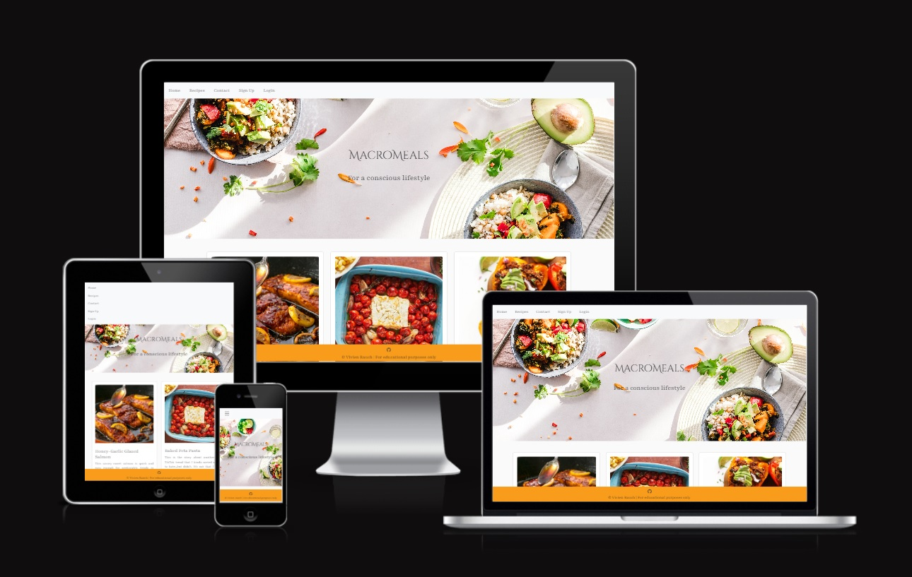
https://ui.dev/amiresponsive?url=https://macromeals-vmr-pp4.herokuapp.com/

## **Repository**

https://github.com/vivienrauch/macromeals-pp4

# **Table of Contents**

- [**Objective** - *Stragety Plane*](#--objective------stragety-plane-)
  * [**User Stories**](#--user-stories--)
  * [**Features** - *Scope, skeleton & structure plane*](#--features------scope--skeleton---structure-plane-)
    + [**Fonts**](#--fonts--)
    + [**Existing Features**](#--existing-features--)
    + [**Future Features**](#--future-features--)
- [**Testing**](#--testing--)
- [**Development**](#--development--)
  * [**Basics to get up and running**](#--basics-to-get-up-and-running--)
- [**Deployment** - *Surface plane*](#--deployment------surface-plane-)
- [**Technologies Used**](#--technologies-used--)
- [**Credits**](#--credits--)

# **Objective**

My objective was to create a vibrant, fresh and elegant looking website that radiates the message of health. I wanted to create a recipe page where users can also know the macronutrients they would consume from a meal.
Planned to realize the CRUD via enabling the user to add and handle their own recipes.

## **User Stories**

- [Kanban board](https://github.com/users/vivienrauch/projects/7)

- [User stories](https://github.com/vivienrauch/macromeals-pp4/issues)

## **Features**

<details>
<summary><strong>Database Structure</strong></summary>


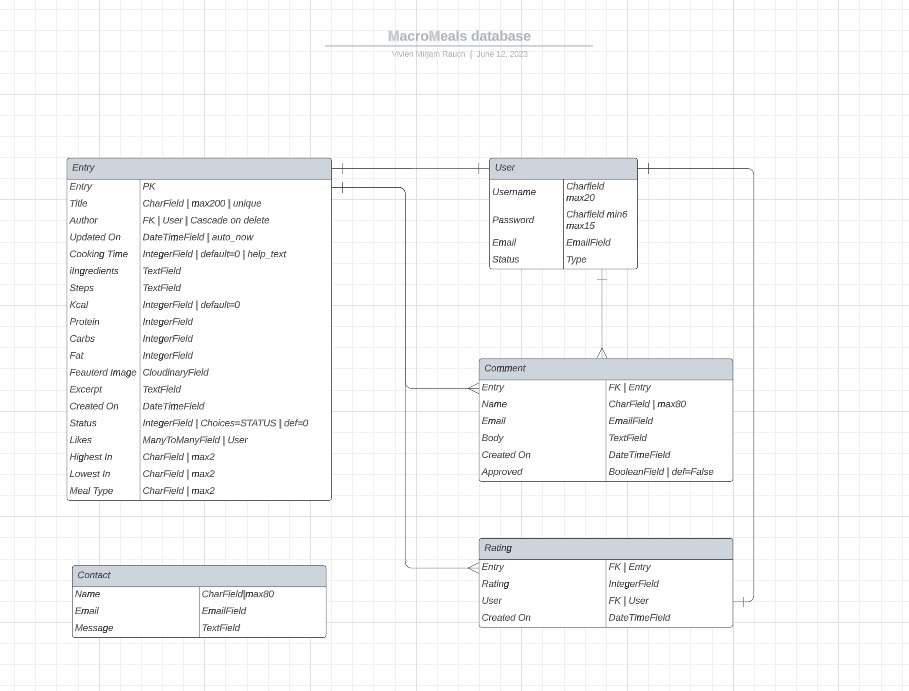
</details>

<details>
<summary><strong>Wireframes</strong></summary>


</details>

<details>
<summary><strong>Colors</strong></summary>

- The color palette of the page was inspired by the main image:


- Text colors:


</details>

### **Fonts**

I used Cinzel Decorative, Cinzel and Playfair to match the vibe I was going for with this website. Classic and elegant.

### **Existing Features**

<details>
<summary><strong>Navigation</strong></summary>

I imagined a simple and straightforward navigation for this page. On the desktop it shows the different pages, when the user is logged in, they get an additional tab which take them to the Add Recipe page. On mobile it collapses and can be accessed via the widely used 'cheeseburger' icon. For aesthetic and practical reasons it drops down  in a column.

- Desktop

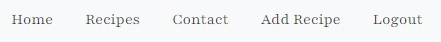

- Mobile

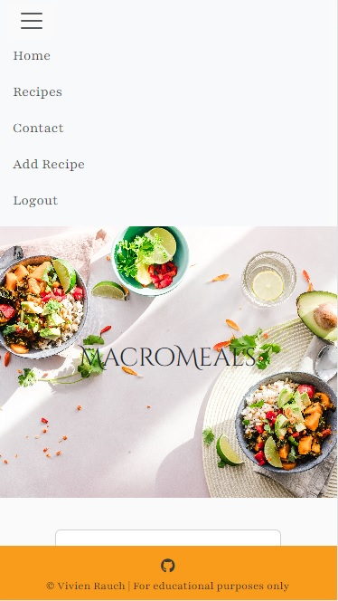
</details>

<details>
<summary><strong>Home page</strong></summary>

The home page - and every page has a main image rendered to it, it creates a oneness among all the tabs, unifying it into a whole.
The recipes are rendered as cards, displaying an image, an excerpt of the recipe, the author, the date and time the recipe was posted,
and the recipe's average user rating.
The home page's pagination is set to three.

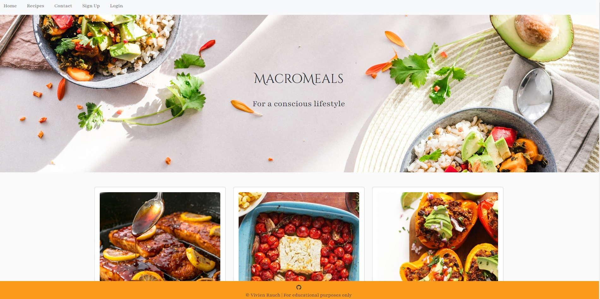

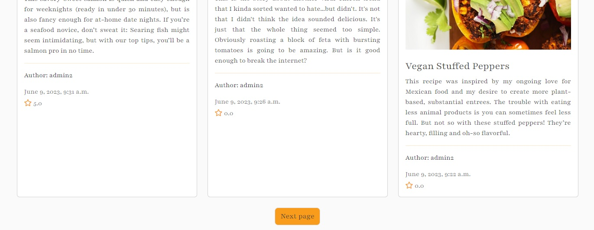

</details>

<details>
<summary><strong>Sign Up Page</strong></summary>

This page allows the user to sign up to use the website's features by creating a username and a password. Providing an email is voluntary at this point.

- Desktop:

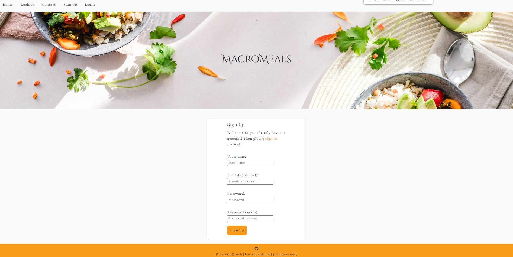

- Mobile:

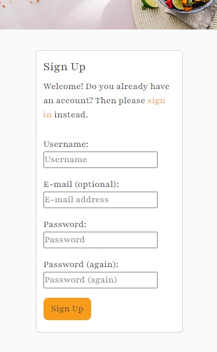
</details>

<details>
<summary><strong>Sign In page</strong></summary>

This page allows registered users to sign in to use the site's features - adding recipe, commenting, rating, editing and deleting recipe they wrote.

- Desktop:

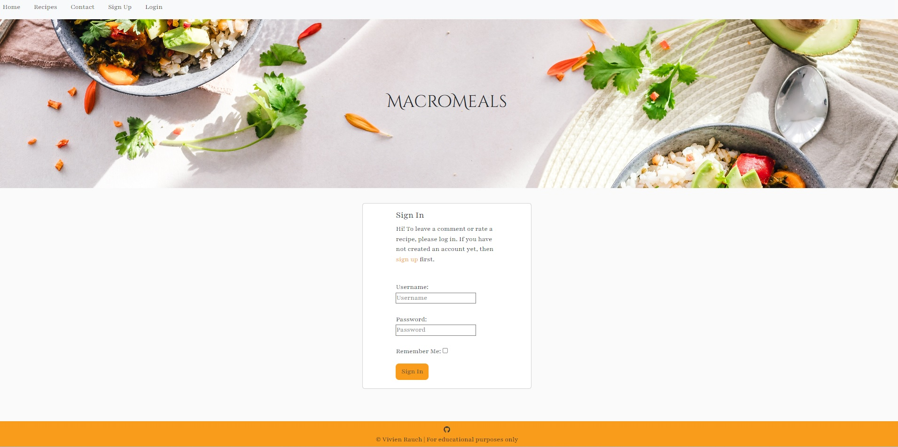

- Mobile:

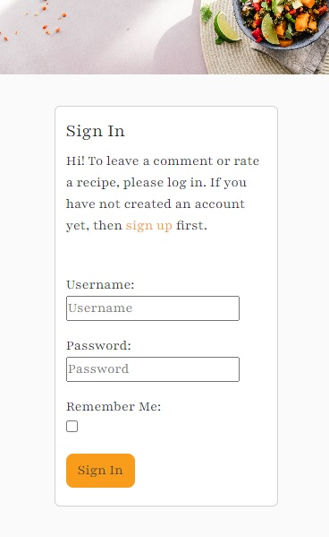
</details>

<details>
<summary><strong>Sign Out page</strong></summary>

This page allows the user to sign out to keep their features safe from a third party.

- Desktop:

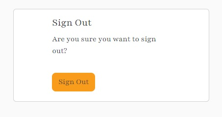

- Mobile:

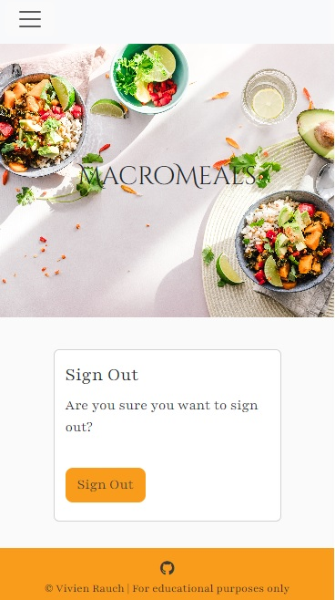
</details>

<details>
<summary><strong>Recipes page</strong></summary>

This page renders all the recipes, paginated by 6.
Almost identical as the home page, only the main image is smaller and there are more recipes rendered in one page.
</details>

<details>
<summary><strong>Recipe details page</strong></summary>

When the user clicks on a recipe card, this is the page where they will be directed to in order to see the full recipe.
It looks a little different for authenticated and non-authenticated users.
Non-authenticated users will see the ratings and the comments, but won't be granted the access to make their own.
Authenticated users on the other hand are able to comment - their comment will be displayed on the page upon admin approval.
They can rate as well - that goes without the need for admin approval.
If the authenticated user happens to be the author of the recipe, they can edit and delete their recipe as well.

- Desktop

What it looks like for authenticated users:
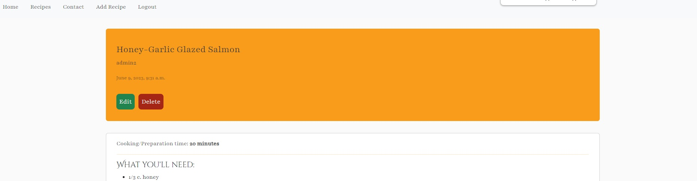
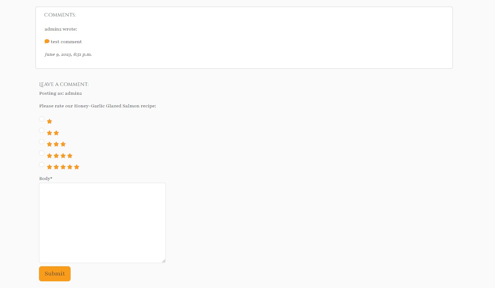

What it looks like for non-authenticated users:
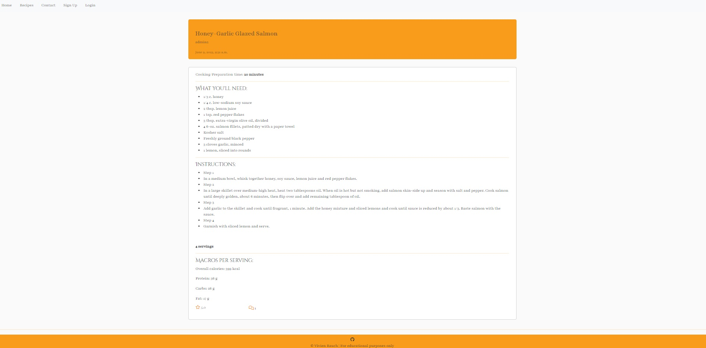

- Mobile

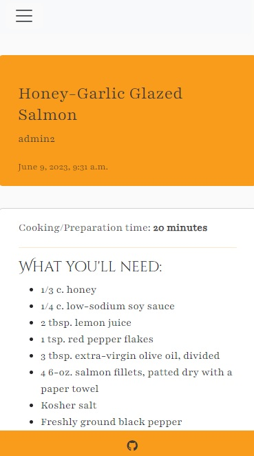

</details>

<details>
<summary><strong>Add recipe page</strong></summary>

This page allows the authenticated user to add their own recipe.

- Desktop:

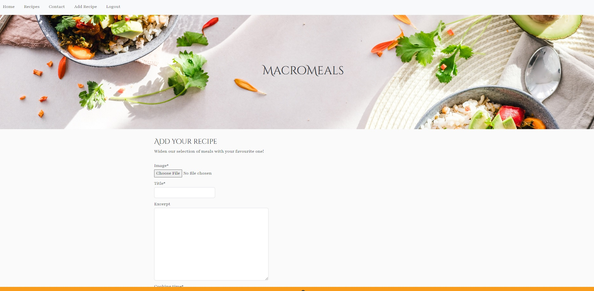

- Mobile:

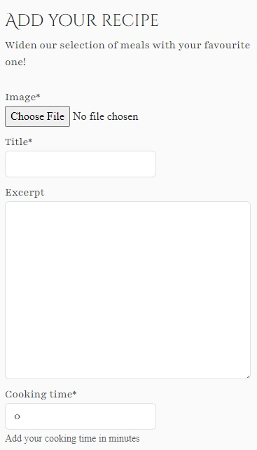
</details>

<details>
<summary><strong>Edit recipe page</strong></summary>

This page allows an authenticated user to edit their own recipe. This page will render the previously saved recipe as a form with the content prefilled, so the user can pick and choose the details they want to edit and the rest will be left untouched.

- Desktop:

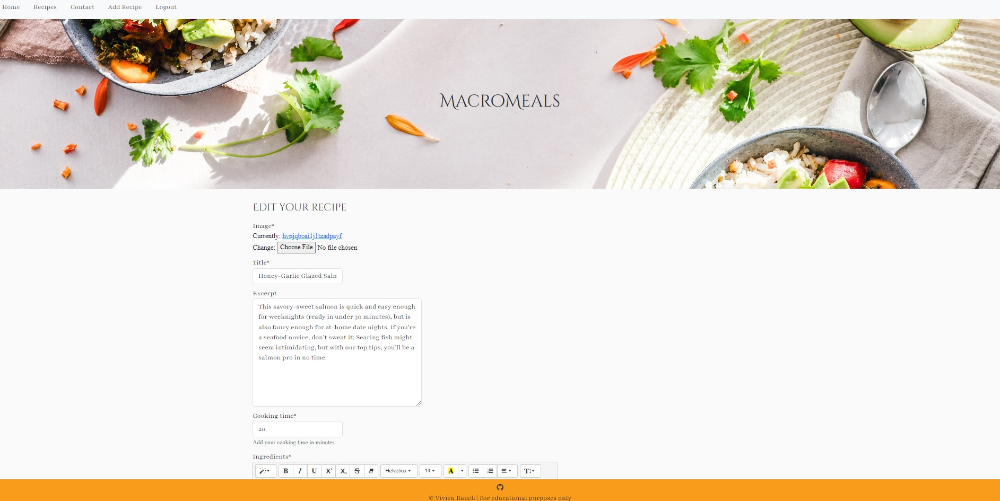

- Mobile:

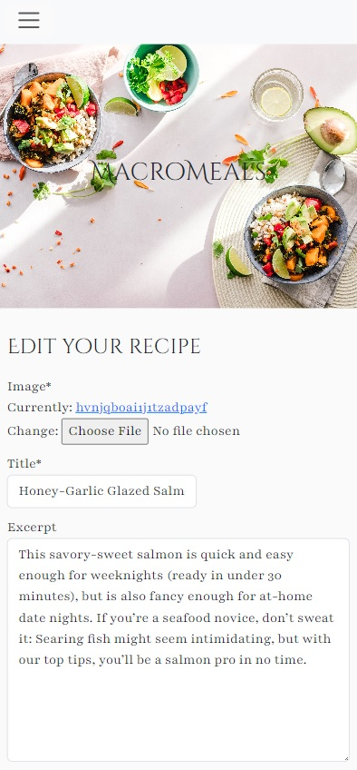
</details>

<details>
<summary><strong>Delete recipe page</strong></summary>

This page allows an authenticated user to delete their own recipe.

- Desktop:

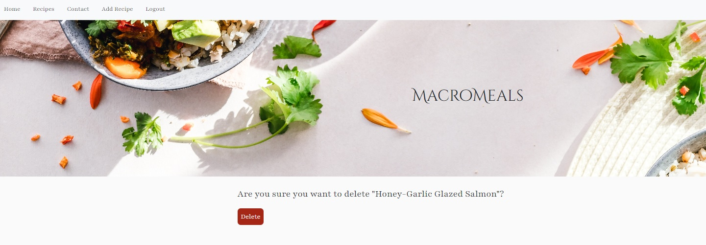

- Mobile:

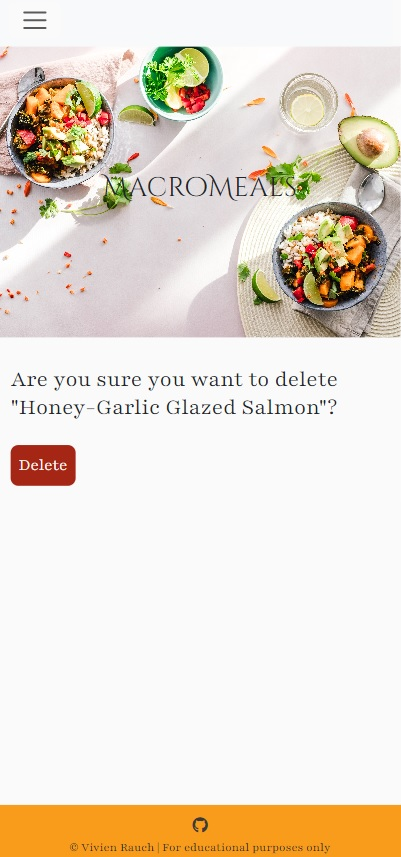

</details>

<details>
<summary><strong>Contact page</strong></summary>

This page allows both authenticated and non-authenticated users to send in a recipe, question or an other kind of reach out.
The form will ask their name, email and their message and all of these fields are obligatory.

- Desktop:

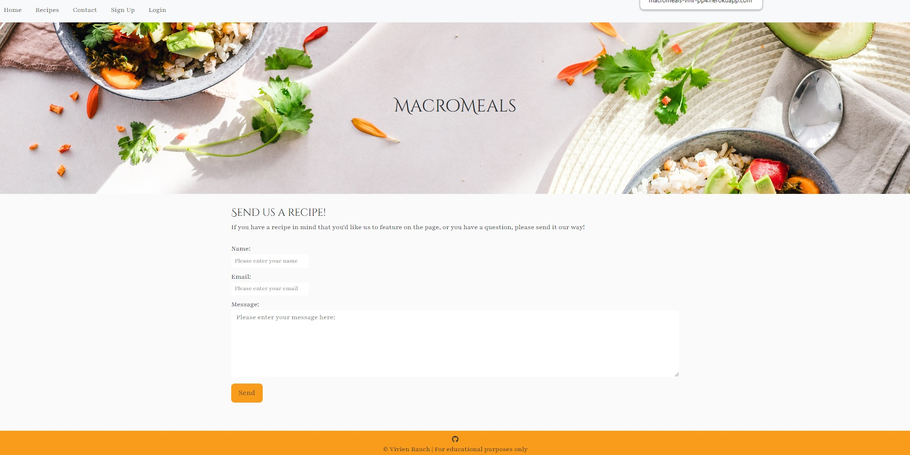

- Mobile:

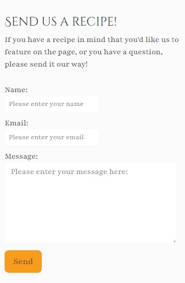
</details>

<details>
<summary><strong>Custom Error pages</strong></summary>

I created custom error pages (403, 404, 405, 500) that is equivalent in style to the other pages of the website, so it creates a coherent vibe.

- Desktop:

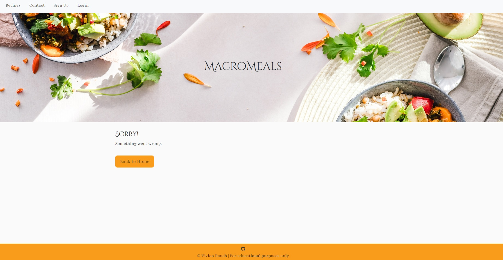

- Mobile:

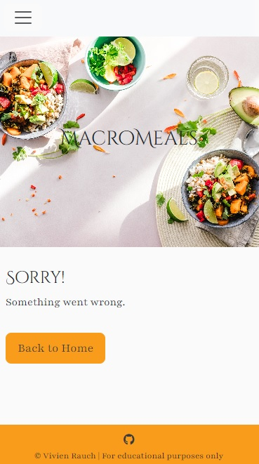
</details>

### **Future Features**

- Edit comment: the access for the user to edit and delete their comment.

- My Recipes page: a page that filters out the particular user's own recipes and renders them in one page

- Bookmark: ability to bookmark a recipe that they like.

- Email verifiation: make email signup mandatory and verifying the user.

- Social sign in: use Google or othern forms of social sign in features.

# **Testing**

Testing details can be found separately in the [TESTING.md](TESTING.md) file.

# **Development**

## **Basics to get up and running**

- Navigate to the [GitHub repository](https://github.com/vivienrauch/macromeals-pp4)
  or use [Code Institute's template](https://github.com/Code-Institute-Org/ci-full-template) to create your own workspace
- Click on Gitpod and create workspace
- Installations:

**Install the server you will use when deploying to Heroku:**
```sh
pip3 install 'django<4' gunicorn
```

**Install supporting libraries:**
- PostgreSQL & psycopg2:
```sh
pip3 install dj_database_url==0.5.0 psycopg2
```

- Cloudinary:
```sh
pip3 install dj3-cloudinary-storage
```

**Create files:**

- requirements.txt:
```sh
pip3 freeze --local > requirements.txt
```

- create new django project:
```sh
django-admin startproject macromeals .
```

- create recipe app:
```sh
python3 manage.py startapp recipebook
```

- set up an env.py file that should look like this:
```sh
import os

os.environ['DATABASE_URL']="Your database url - see in deployment"
os.environ['SECRET_KEY']="Your secret key"
os.environ['CLOUDINARY_URL']="Your Cloudinary API environment variable - see in deployment"
```
- modify the SECRET_KEY variable in settings.py the following way:
```sh
SECRET_KEY = os.environ.get('SECRET_KEY')
```

- for deployment in Heroku, you'll need to create Procfile

# **Deployment**

- This project users [ElephantSQL](https://www.elephantsql.com/) as its database solution. How you can obtain one and wire it up to your repository:
    - Use your GitHub account to sign up
    - Provide a name that ideally is consistent with your project's name
    - Select the *Tiny Turtle* (free) plan
    - You can leave the *Tags* empty
    - Select your region
    - You can access the the database url and password by clicking on your database's name

- This project uses [Cloudinary](https://cloudinary.com/) to store its media files since Heroku don't keep these files
    - Use your GitHub account to sign up
    - Copy your API environment variable

- This project uses [Heroku](https://heroku.com/) for deployment
    - set up an account
    - In the top right corner you'll find the button *new*
    - Click *Create new app*
    - Choose your region and a unique application name
    - Once created, navigate to *Settings*
    - Click on *Reveal Config Vars*
    - Add the keys and values from your env.py file
    - Add **PORT:8000**
    - Temporarily add **DISABLE_COLLECTSTATIC:1** - to be removed for final deployment
    - You can choose between different methods of deployments on the *Deploy* tab
    - As well as *Manual* and *Automatic* deploys

- The deployed page is available [here](https://macromeals-vmr-pp4.herokuapp.com/)

# **Technologies Used**

- Languages, Databases and Frameworks:

    - **HTML**
    - **CSS**
    - **Javascript (Bootstrap JS)**
    - **Python**
    - **Django**
    - **PostgreSQL**
    - **psycopg2**
    - **Bootstrap**

- Other tools:

    - [Canva](https://www.canva.com/)
    - [Pexels](https://www.pexels.com/)
    - [Cloudinary](https://cloudinary.com/)
    - [Font Awesome](https://fontawesome.com/)
    - [Favicon Generator](https://favicon.io/favicon-converter/)
    - [Google Fonts](https://fonts.google.com/)
    - [LucidCharts](https://lucid.app/)
    - [Balsamiq](https://balsamiq.com/)
    - [Heroku](https://www.heroku.com/)
    - [Table of contents generator](https://ecotrust-canada.github.io/markdown-toc/)

# **Credits**

- The [Think therefore I blog project](https://github.com/Code-Institute-Solutions/Django3blog) gave the basis of the whole project
- Tutor Support
- Slack community
- Stackoverflow
- Youtube:
    - Inspo to edit posts:
    https://www.youtube.com/watch?v=p5gYHSFT_QA&t=301s
    https://www.youtube.com/watch?v=p5gYHSFT_QA
    https://www.youtube.com/watch?v=m3efqF9abyg
- The recipe content came from the following pages:
    https://www.emilieeats.com/
    https://minimalistbaker.com/
- Inspo from fellow students:
    https://github.com/TheresLundqvist/Ski-resorts/tree/main
    https://github.com/Maya-Claveau/pp4-fungi-news
    https://github.com/Sharpryan20/food-twisters


