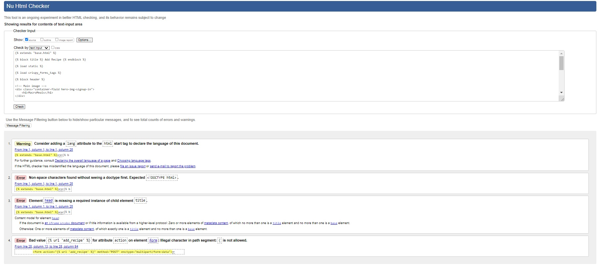

# **Testing**

## **Code Validation**

HTML

The HTML files were validated with the [W3C Validator Service](https://validator.w3.org/).

- Home page - PASS

- Sign Up - PASS

- Sign In - PASS

- Logout - PASS

- Recipes - PASS

- Recipe detail

- Add Recipe - 
I get several warnings and errors which either come from the crispy forms,
the summernote widgets or from the curly braces

Page source code:

Workspace html file:

- Edit Recipe - PASS

- Delete Recipe - PASS

- Contact - PASS

CSS

The CSS file was validated using the [W3C Jigsaw Validator Service](https://jigsaw.w3.org/css-validator/).
It passed the validation process without warnings or errors.

Python

The Python files were validated using the [Pep8 linter](https://pep8ci.herokuapp.com/#)

- models.py - PASS

- forms.py - PASS

- views.py - PASS

- admin.py - PASS

## **Lighthouse**

Desktop

- Home

- Sign Up

- Sign In

- Logout

- Recipes

- Recipe - logged in

- Recipe - logged out

- Add recipe

- Edit recipe

- Delete recipe

- Contact

Mobile

- Home

- Sign Up

- Sign In

- Logout

- Recipes

- Recipe - logged in

- Recipe - logged out

- Add recipe

- Edit recipe

- Delete recipe

- Contact

## **Bugs**

- Fixed bugs

    - Deployment didn't work at first due to collectstatic error and crispy forms error.
      Crispy forms was installed however, it wasn't saved into the requirements.txt file.
      When I corrected that, it worked fine.

    - I had image issues when I tried to edit a recipe in the frontend.
      I changed the request to request files, too, it worked fine.

    - When editing the form, the page didn't render the preexisting form.
      I rewrote the code in a way that it's not a request but an UpdateView and also changed the url path.
      I can't pinpoint one thing that made the difference, I just adjusted the code until it finally clicked.

- Unfixed bugs

    - I can't make the entry model choices (macro_high, macro_low, meal_type) to render on the saved page
      in a proper way.
      So it is only displayed when adding a recipe but not rendered on the saved recipe page.

    - I couldn't figure out how to resize the summernote widget field to fit the mobile screen properly.

    - For some reason the toggle navigation is stuck in an 'in-between' state on Ipad Mini screen.

Return to [README.md](README.md#macromeals-pp4)