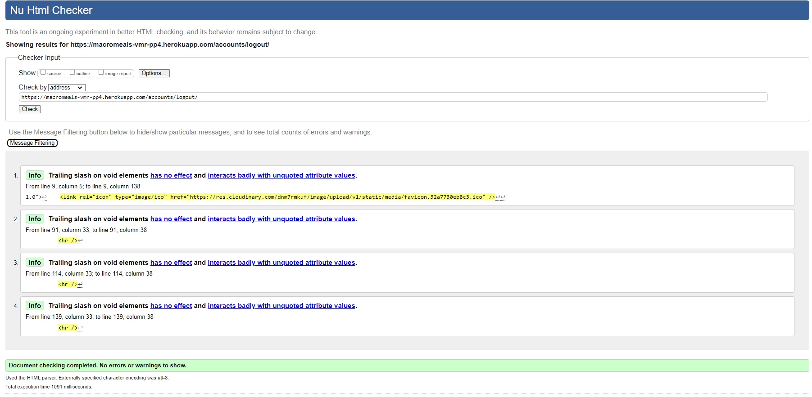
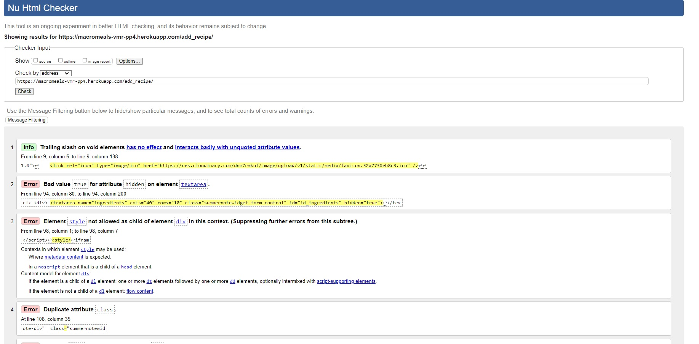

# **Testing**

## **Manual Testing**

### **Code Validation**

**HTML**

The HTML files were validated with the [W3C Validator Service](https://validator.w3.org/).

- Home page - PASS

- Sign Up - PASS

- Sign In - PASS

- Logout - PASS

- Recipes - PASS

- Recipe detail

- Add Recipe

- Edit Recipe

- Delete Recipe

- Contact

### **Methodology**

### **Test Cases**

## **Code Validation**

### **HTML**

### **CSS**

### **JavaScript**

### **Python**

## **Lighthouse**

Return to [README.md](README.md#macromeals-pp4)